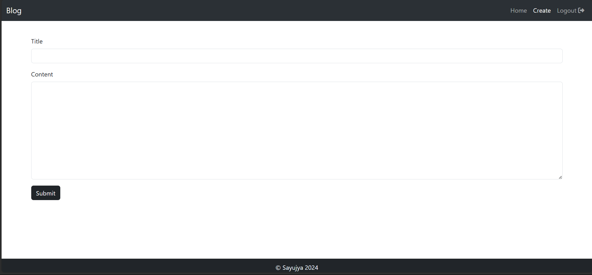

# BLOG APP

A simple project done in laravel and mysql for the completition of 4th Sem Project.

## Steps To Run:

<li> <a href="https://download-directory.github.io/?url=https%3A%2F%2Fgithub.com%2FAyjuYaas%2FBIM%2Ftree%2Fmain%2F04_BIM4th%2F4thSemProject-BlogApp">Download</a> the folder and extract it.

<li>Follow the following steps in your terminal:

```bash
cd 4thSEMPROJECT-BLOGAPP # or the foldername incase it's renamed

composer install

cp .env.example .env #if using cmd: use copy instead of cp
```

<li>Open your <code>.env</code> file and change the database name (<code>DB_DATABASE</code>) to whatever you have, username (<code>DB_USERNAME</code>) and password (<code>DB_PASSWORD</code>) field correspond to your configuration.</li>

<li>Insert your font awesome kit key in the <code>.env</code> file [OPTIONAL]
<li>Run your <code>local database server (XAMPP)</code>.</li>

```bash
php artisan key:generate

php artisan migrate

php artisan serve
```

## PREVIEW




<br /> <br />
By:
Sayujya Satyal
021BIM054
